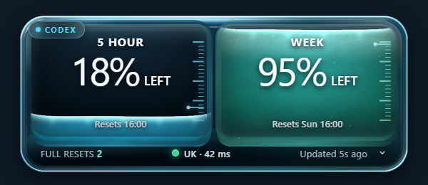
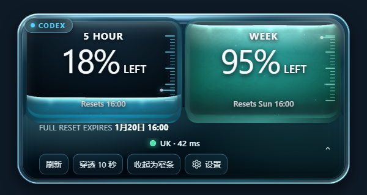
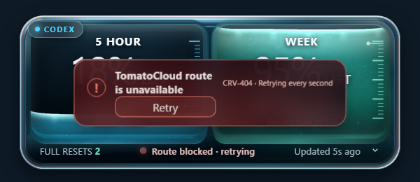

# QuoDex

<p align="center">
  
</p>

_Windows 11 与 macOS 上的轻量配额桌面浮窗，原名 Codex Meter。_

当前版本：**0.0.8**

---

**QuoDex**（**Quo**ta + Co**dex**）通过本机 Codex `app-server` 读取只读配额数据，在一个可拖动的液态玻璃浮窗中并列展示 **5 小时额度**和**一周额度**；同时支持读取 **ZCode 编程包**（bigmodel coding-plan）的配额，可手动切换或轮播显示两个来源。应用手动启动、常驻通知区域，不创建开机启动项，也不会占用普通任务栏位置。

> [!IMPORTANT]
> QuoDex 是非官方社区项目，与 OpenAI 或 ChatGPT 无隶属、赞助或背书关系。



_图 1：QuoDex 正常状态；TomatoCloud 显示绿色健康路由（UK · 42 ms）。截图使用测试数据，不包含真实账号或配额信息。_

## ✨ 主要功能

- 以同等视觉层级展示 5 小时和一周剩余额度
- 液体高度随剩余百分比线性变化
- 每 5 秒自动刷新，紧跟额度消耗节奏，也可在展开视图中手动刷新
- 展示额度重置时间和可用完整重置次数
- 支持紧凑、展开和窄条三种布局
- 支持窗口拖动惯性，以及随液位与每次启动种子变化的独立液体晃动
- 端到端监测 TomatoCloud 路由：通过本机系统代理发起真实 HTTPS Route Probe，显示连接灯、出口国家缩写和延迟
- TomatoCloud 正常时每 5 秒探测；阻塞或断开时每 1 秒复测，连续两次失败后才让整个液态玻璃边缘红色闪烁报警
- 支持 10 秒鼠标穿透、透明度调节和减少动效
- 关闭窗口后隐藏到 Windows 通知区域，可从托盘重新显示或退出
- 数据读取失败时保留最近一次有效数据，并显示稳定诊断码
- 支持 ZCode 编程包额度源：自动发现 `~/.zcode` 中启用的 coding-plan，经 bigmodel 监控端点只读查询 5 小时/周双窗口、点数与套餐档位
- 左上角来源徽章（Codex 青 / ZCode 翡翠绿）标识当前显示的额度来源；ZCode 的 5 小时舱使用月光银、周舱使用翡翠绿，窄条模式以对应色点区分
- 设置面板可切换「Codex / Zcode / 轮播」，轮播每 10 秒交替展示两个来源，选择持久化保存

## 🖼️ 界面状态

| 紧凑视图 | 展开视图 | 路由阻塞 |
| --- | --- | --- |
|  |  |  |

其他确定性测试状态包括[加载状态](docs/verification/screenshots/quodex-loading.png)和[窄条状态](docs/verification/screenshots/quodex-collapsed.png)。这些截图均由测试夹具生成，可随时用 `?fixture=` 开发页面复现。

## 🚀 Quick Start

**运行要求**：Windows 11 x64（macOS 11+ 为实验性支持，见下文构建章节），且当前用户已登录 Codex。

1. 从 [GitHub Releases](https://github.com/bandit0x/Codex-Meter/releases) 下载并运行安装包 `QuoDex-<版本>-win-x64-setup.exe`；或下载便携包并**完整解压**（保持目录结构完整，不要单独移动 `QuoDex.exe`）
2. 双击 `QuoDex.exe`（或桌面快捷方式），浮窗即显示额度
3. 按住浮窗非按钮区域拖动位置；点击右下角箭头展开刷新、穿透、设置等操作
4. 关闭浮窗只是隐藏到通知区域；完全退出请右键托盘图标选择「退出」

应用不会自动开机启动，重启 Windows 后需再次手动运行。

## 🛠️ 从源码运行

### 开发环境

- Node.js 24
- Rust MSVC 工具链
- Visual Studio C++ Build Tools
- Tauri 2 所需的 Windows 构建组件[^tauri-prerequisites]

在 PowerShell 中运行：

```powershell
npm.cmd ci
npm.cmd run tauri:dev
```

开发构建默认使用测试夹具。需要连接当前用户的真实 Codex 账号时：

```powershell
$env:CODEX_CREDITS_USE_LIVE = "1"
npm.cmd run tauri:dev
```

不要直接双击 `src-tauri\target\debug\codex-credits-view.exe`；它是开发版，会访问 `localhost:1420`，必须通过 `npm.cmd run tauri:dev` 启动并保持 Vite 服务运行。

界面截图可由确定性测试夹具复现：启动 `npm.cmd run dev` 后访问 `http://localhost:1420/?fixture=v7-healthy`（另有 `v7-expanded`、`v7-collapsed`、`v7-loading`、`v7-route-blocked`、`zcode-healthy`、`zcode-failed`、`zcode-carousel`）。

### 运行检查

```powershell
npm.cmd run typecheck
npm.cmd run test
npm.cmd run build
cargo clippy --manifest-path src-tauri\Cargo.toml --all-targets -- -D warnings
cargo test --manifest-path src-tauri\Cargo.toml
```

### 构建便携包

先下载并验证 Microsoft WebView2 Fixed Version Runtime：

```powershell
pwsh.exe -NoProfile -ExecutionPolicy Bypass `
  -File scripts\fetch-webview2-fixed-runtime.ps1
```

然后构建应用并生成便携目录：

```powershell
pwsh.exe -NoProfile -ExecutionPolicy Bypass `
  -File scripts\package-portable.ps1
pwsh.exe -NoProfile -ExecutionPolicy Bypass `
  -File scripts\verify-portable-brand.ps1
```

输出位于 `release/QuoDex-<版本>-win-x64/`，目录结构为 `QuoDex.exe` + `codex-runtime/` + `webview2-runtime/`。请将整个目录压缩后作为 GitHub Release 附件发布，不要把运行时或构建产物提交进源码仓库。

### 构建安装包

完成 WebView2 Fixed Version Runtime 下载后运行：

```powershell
npm.cmd run package:installer
```

输出位于 `release/QuoDex-<版本>-win-x64-setup.exe`。安装器会内置 Codex 与 WebView2 运行时，并在桌面创建或替换 `QuoDex` 快捷方式。

### macOS 构建（实验性）

macOS 11+（Intel 或 Apple Silicon），需要 Node.js 24、Rust 工具链和 Xcode Command Line Tools：

```bash
npm ci
npm run tauri:dev        # 开发模式
npm run package:app      # 构建 .app / .dmg
```

输出位于 `release/macos/QuoDex.app`。开发构建默认使用测试夹具，连接真实 Codex 账号时设置 `CODEX_CREDITS_USE_LIVE=1`。macOS 版应用不进 Dock，只驻留菜单栏图标；关闭浮窗后通过菜单栏图标重新显示或退出。TomatoCloud 监测需要本机运行 TomatoCloud 客户端并启用系统 HTTPS 代理，否则面板会显示阻塞状态。

## 🔐 数据与隐私

QuoDex 启动独立的本机 Codex `app-server` 进程，通过只读 JSON-RPC 请求获取账号配额。认证和网络通信仍由官方 Codex 运行时处理。[^codex-app-server]

应用不会：

- 读取其他进程的内存
- 读取浏览器 Cookie 或登录令牌
- 要求 `.env`、API Key 或个人访问令牌
- 修改账号状态或自动使用完整重置次数
- 将配额、日志或配置上传到第三方服务

TomatoCloud 监测同样只使用公开的本机可观测边界：检查运行所需进程、读取已启用的 Windows 本地系统代理，并通过该代理完成真实 HTTPS 请求。应用不会读取 TomatoCloud 的私有 IPC、日志、配置、内存或凭据。仅进程仍在运行并不代表连接健康；只有 Route Probe 成功时才显示绿色状态、出口国家缩写和 `XX ms` 延迟。

本地仅保存窗口位置、透明度和减少动效等显示偏好。

## 🧱 技术组成

| 层 | 技术 | 职责 |
| --- | --- | --- |
| 桌面外壳 | Tauri 2、Rust | 窗口、托盘、进程生命周期和 JSON-RPC |
| 用户界面 | React 19、TypeScript、Vite | 配额状态、交互、设置和错误恢复 |
| 材质与动效 | WebGL2、GLSL | 光学舱体、体积液体、折射和惯性反馈 |
| 配额数据 | `@openai/codex` | 本机 `app-server` 和账号配额接口 |
| 渲染运行时 | Microsoft Edge WebView2 | Windows WebView 渲染 |

项目固定使用已经验证的 Codex 和 WebView2 运行时版本，以减少不同机器之间的协议及渲染差异。

## 📦 更新日志

### 0.0.8 · 更名 QuoDex，5 秒刷新

- 项目更名为 **QuoDex**（Quota + Codex，原名 Codex Meter）：窗口标题、托盘、桌面快捷方式、便携包/安装包/macOS 应用产物与 CI 流水线统一采用新名称
- 额度自动刷新间隔由 60 秒缩短为 **5 秒**，紧跟额度消耗节奏
- README 配图全部由当前构建的确定性测试夹具重新生成

### 0.1.7 · 设置面板退出应用与多平台 CI

- 设置面板新增退出应用入口
- 新增 macOS 与 Windows 双平台测试和打包流水线，并修复 Windows 打包环境变量污染

### 0.1.6 · 支持macOS

- 新增 macOS 支持：同一套 Tauri 外壳移植到 macOS 11+，浮窗驻留菜单栏（不进 Dock），Codex 与 ZCode 额度源、TomatoCloud 路由监测全部可用，提供 `.app` / `.dmg` 打包
- 修复 ZCode 0 用量窗口触发 `CRV-508` 的问题：bigmodel 端点对未消耗的 5 小时窗口不返回 `nextResetTime`，快照不再因此整体失败，重置时间缺失时显示 `Resets —`
- ZCode 窗口归属改为按响应中的 `unit`/`number` 识别（3/5 为 5 小时、6/1 为周），周窗口恰好 0 用量时两个舱的数据不再互换

### 0.1.5 · 修复了部分显示错误

- 修复 TomatoCloud 短暂失败并恢复时的 stale 视觉处理，Codex 的两个液体舱不再被统一去色为月光银
- 保留 stale 数据提示的降亮度效果，同时维持 5 小时舱 cyan 与周舱 mint 的语义色
- 补充“TomatoCloud 失败 → 恢复”时序的前端回归测试，并更新 0.1.5 便携包、安装包与桌面快捷方式

### 0.1.4

- 合并 ZCode 编程包额度源：自动发现启用的 coding-plan，读取 5 小时和一周窗口、点数与套餐档位，并支持手动切换和 10 秒轮播
- ZCode 配额探测对缺失关键字段返回稳定的 `CRV-508`，不再把异常响应显示为 `0 / 0` 或 Epoch 重置时间
- 区分 `curl` 网络进程失败（`CRV-504`）与配额端点 HTTP 异常（`CRV-505`），请求超时时自动终止子进程
- 将前端、Tauri、Rust、锁文件和便携包/安装包脚本的版本统一为 `0.1.4`

### 0.1.3

- 修复液体仓底部空缺：液体渲染层现在会连续延伸到下沉的玻璃底唇，两个舱体底部不再露出空白条带
- WebGL2 与 Canvas 2D fallback 共用下沉液体延伸尺寸，保持 5 小时和一周百分比的液面高度映射一致
- 保留原有液态玻璃外壁、footer 遮挡关系、液体波浪和拖动惯性，不新增白色边框或分界线
- 将 TomatoCloud 健康探测与出口国家查询解耦；健康探测使用 5 秒连接超时和 8 秒总时限，国家服务短暂不可用不会误报整条路由断开
- 对已建立的健康路由增加连续两次失败确认，第一次瞬时失败保留上次状态并继续每秒复测
- 将前端、Tauri、Rust、锁文件和便携包/安装包脚本的版本统一为 `0.1.3`

### 0.1.2

- 新增 TomatoCloud 端到端路由监测：通过已启用的 Windows 本地系统代理发起真实 HTTPS Route Probe，不把“进程仍在运行”误认为连接正常
- 在共享页脚显示连接指示灯、出口国家缩写和 Route Probe 延迟，例如 `UK · 42 ms`
- 健康状态每 5 秒探测；路由阻塞或断开后每 1 秒复测，并让整个液态玻璃外沿红色闪烁报警
- 路由阻塞时显示统一的跨双舱错误面、稳定诊断码和 `Retry` 操作；即使 Codex 配额读取失败，TomatoCloud 报警也不会消失
- 补充 TomatoCloud 阻塞、Codex 数据不可用时仍保留报警的自动化测试，并将安装包、便携包和 Tauri/Cargo 元数据统一到 `0.1.2`

### 0.1.1

- 将前端、Tauri、Rust 和安装脚本的版本统一为 `0.1.1`
- 安装器构建使用隔离的 Cargo 目标目录，避免构建缓存污染发布目录，并可靠定位 NSIS 输出
- 便携包和安装包文件名统一采用版本化格式
- 增加 Windows 可执行文件图标和便携包品牌校验所需的发布证据

## 🤝 参与贡献

欢迎提交 Issue 和 Pull Request。问题报告请包含系统版本、复现步骤和诊断码；请勿公开上传令牌、日志、账号截图或其他敏感信息。

提交代码前，请运行“运行检查”中的前端与 Rust 命令。涉及界面的修改请附上真实 Tauri/WebView2 截图。

## 📄 许可证

项目源码采用 [MIT License](LICENSE)。第三方组件和便携运行时分别遵循 [`THIRD_PARTY_NOTICES.md`](THIRD_PARTY_NOTICES.md) 中列出的许可证与再分发条款。

## 🙏 致谢

- [OpenAI Codex](https://github.com/openai/codex)：本机运行时和 `app-server` 协议
- [Tauri](https://github.com/tauri-apps/tauri)：Windows 桌面外壳
- [WebGL Fluid Simulation](https://github.com/PavelDoGreat/WebGL-Fluid-Simulation)：流体运动参考
- [Canvas UI](https://github.com/DavidHDev/canvas-ui)：光学玻璃材质参考

[^codex-app-server]: OpenAI. “Codex `app-server`.” <https://github.com/openai/codex/blob/main/codex-rs/app-server/README.md>

[^tauri-prerequisites]: Tauri. “Prerequisites: Windows.” <https://v2.tauri.app/start/prerequisites/#windows>
