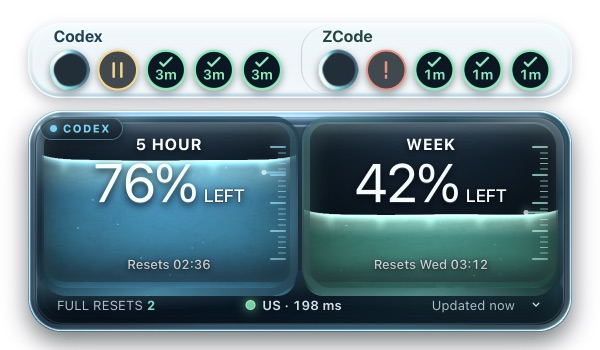
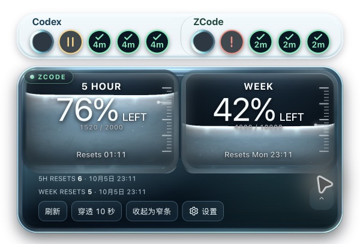
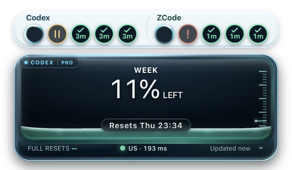
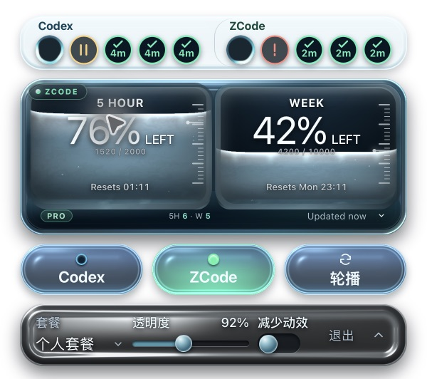
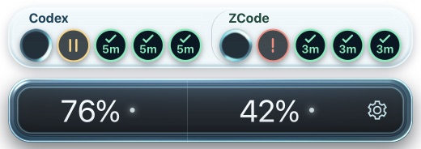
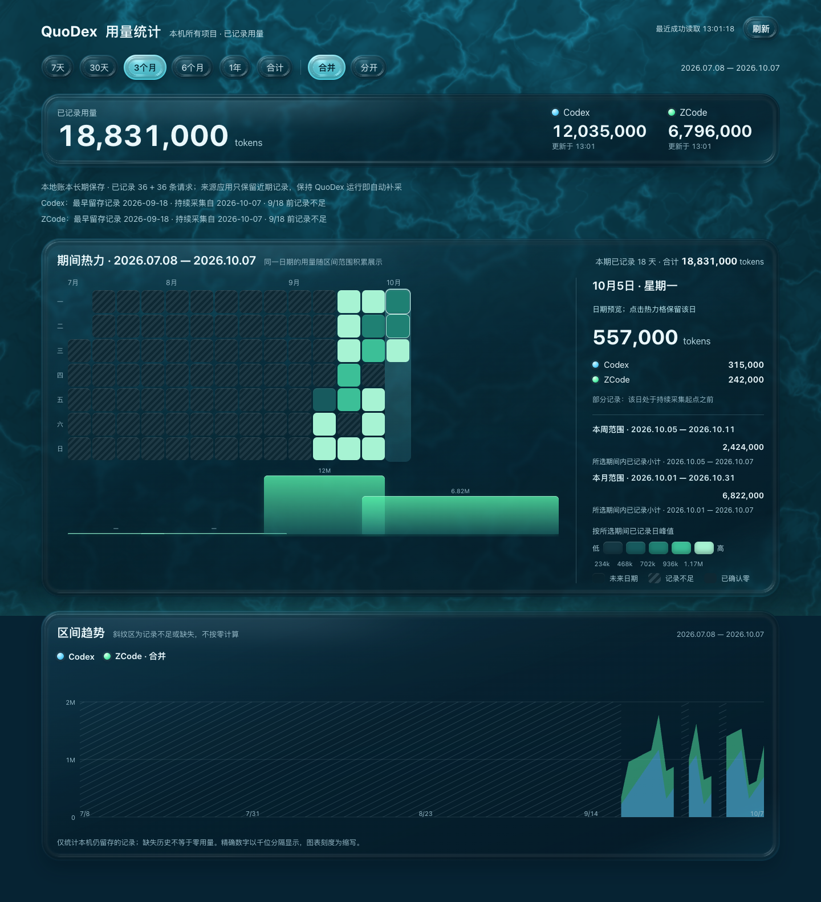
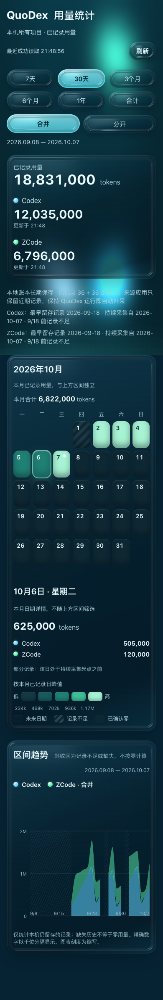

# QuoDex

  

用一个液态玻璃浮窗，查看 **Codex / ZCode** 的剩余额度、重置时间和任务状态。

**v0.4.0** · Windows 11 x64 / macOS · [下载安装](https://github.com/bandit0x/QuoDex/releases/tag/v0.4.0)

**简体中文** · [English](README.en.md)

## 主要功能

- **额度与重置**：查看 5 小时、周额度或单池套餐，支持 Codex / ZCode 切换与轮播，以及可用重置次数。
- **两组任务**：Codex 与 ZCode 始终同时可见，每组直接显示 5 项，区分运行、等待、成功和报错；完成提醒可一键移除。
- **液态玻璃**：液面随余额变化，拖动时自然晃动；支持紧凑、展开、窄条视图和透明度调节。
- **用量统计**：设置面板一键打开本机网页，查看本机所有项目的 Codex / ZCode token 用量——7 天到 1 年六区间、合并/分开、月度热力墙与趋势图；本地账本长期留存，来源应用清理历史不影响已入账数据。

## 界面

<table>
  <tr>
    <th>Codex</th>
    <th>ZCode</th>
    <th>Codex Pro</th>
  </tr>
  <tr>
    <td align="center">
      
    </td>
    <td align="center">
      
    </td>
    <td align="center">
      
    </td>
  </tr>
</table>

<table>
  <tr>
    <th>设置</th>
    <th>窄条</th>
  </tr>
  <tr>
    <td align="center">
      
    </td>
    <td align="center">
      
    </td>
  </tr>
</table>

<table>
  <tr>
    <th>用量统计 · 本机网页</th>
    <th>窄屏</th>
  </tr>
  <tr>
    <td align="center">
      
    </td>
    <td align="center">
      
    </td>
  </tr>
</table>

浮窗截图来自 v0.3.0 原生 macOS App，额度和任务均为匿名演示数据；用量页截图来自匿名夹具数据。[截图来源](docs/verification/v0.3.0/README.md) · [用量页验证](docs/verification/usage-liquid-glass/)

## 开始使用

1. 从 [Releases](https://github.com/bandit0x/QuoDex/releases/tag/v0.4.0) 下载对应系统的安装包：Windows 使用 `.exe`，macOS 使用 `.dmg` 并将 App 拖入 Applications。
2. 确保所需的 Codex / ZCode 已登录，启动 QuoDex 后选择额度来源。
3. 拖动浮窗调整位置，点击右下角箭头展开；右键主仓打开设置。

关闭浮窗会隐藏到托盘或菜单栏；完全退出使用“退出”。

macOS 发布包采用 ad-hoc 签名，尚未公证。当前自动发布提供 Apple Silicon 包；Intel 可[从源码构建](docs/DEVELOPMENT.md#macos-构建)。

## 更多

- [使用说明与数据隐私](docs/USAGE.md)
- [开发、构建与配置](docs/DEVELOPMENT.md)
- [更新日志](CHANGELOG.md)
- [问题反馈](https://github.com/bandit0x/QuoDex/issues)

QuoDex 是非官方社区项目，与 OpenAI 或 Bigmodel 无隶属或背书关系。

源码采用 [MIT License](LICENSE)，第三方组件遵循 [各自许可证](THIRD_PARTY_NOTICES.md)。
