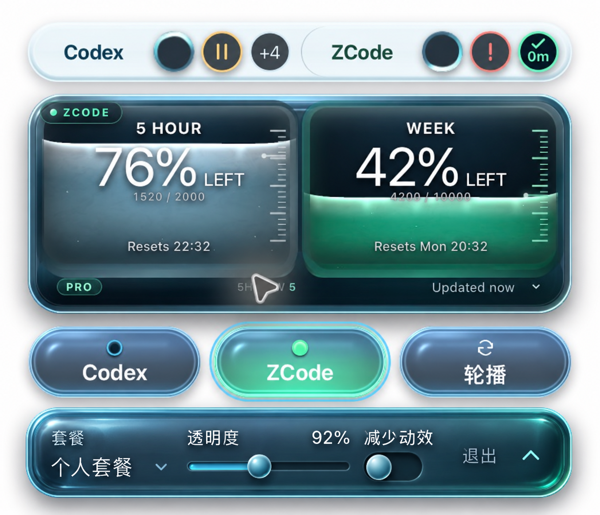

# 设置控制仓材质契约

用户最新修正：下方控制仓不接受左右蓝绿分色，厚度须由曲面反光、高光、内外壁和暗部表达；任务名称须按任务数量调整位置，每个来源至少容纳 5 个实际任务状态。此前目标图只作为反射和曲面参考，其中蓝绿色块已被用户否决；图不是实际 App 截图。B 的独立任务条、原液态仓和三个来源按钮保持已批准的结构。本页记录目标与表面布局；可复用的样式 tokens 见根目录 [DESIGN.md](../../../DESIGN.md)，光学、阴影和动效扩展见 [.impeccable/design.json](../../../.impeccable/design.json)。当前版本、原生证据、验收状态与限制只维护在[验收记录](../../verification/settings-dock/README.md)。

最下方控制仓采用同一低饱和中性玻璃内腔，左右环境反射和 CSS 内阴影不再使用分裂的蓝绿色。宽厚折射壁、左上受光、内壁回光和下沿暗部形成厚度；中心也要有可辨认的曲面、吸收与反射。套餐、细槽滑轨、珠式开关属于同一内腔。保留独立收起箭头，成功勾不能替代收起操作。失败诊断和重试留在同一玻璃体内，不能另加不透明色条。

实现边界：控制面的曲面法线、光程和 Fresnel / GGX 响应必须连续衔接到壁面。[OpticalShell.tsx](../../../src/OpticalShell.tsx) 的 `controlSurface` 分支将卷边壁面与中心冠面合为一个高度场，由有限差分求法线；Fresnel、GGX、有限软箱反射与按光程计算的 Beer–Lambert 吸收覆盖控制中心及壁面，中心反射不再乘壁面 rim。具体参数以 sidecar 为准。原液态仓默认绘制路径独立保留。不得以增亮描边、假液面、气泡或放大渐变代替曲面。上述模型是源码事实，不能据此宣布观感符合目标。

[SettingsDock.tsx](../../../src/SettingsDock.tsx) 与 [SettingsDock.css](../../../src/SettingsDock.css) 将套餐、透明度和减少动效组织在同一内舱；WebGL 路径关闭额外 CSS 双描边。滑轨焦点沿细槽，保存勾与收起箭头保留独立位置。透明度即时预览，在松手、键盘提交或失焦时保存；真实失败保留原值、诊断编号和重试。关闭提交当前预览；退出先提交并等待串行写入，保存失败时保留控制坞。

布局沿用 B：独立浅色任务条 → 透明间距 → 原液态仓 → 透明间距 → 三个来源透镜 → 独立控制坞。任务条与液态仓不共用外框。常规宽 300px、窄条宽 260px，来源透镜高 36px，与下坞间距 6px，下坞高 44px；设置总体增加 92px，真实错误增加 24px。这些是 Tauri 逻辑尺寸，框架以 `0.5` 缩放 CSS 画布，源码 CSS 尺寸为其两倍；系统缩放进一步影响截图物理像素。窄条仅收紧内边距、列间距和套餐列，保留全部功能。设置不遮任务和额度，展开避让工作区底边，Esc 收起恢复。来源切换只切额度，两组任务继续更新。若图中文字尺寸与真尺寸排版冲突，以清晰可读和功能完整为准，不照搬生成图的像素。

每个任务来源独立按数量调整：1–2 项时名称与圆圈同排，3 项及以上时名称上移、圆圈占下一整排。最多直接展示 5 个实际任务，额外 `+N` 放在名称行，不能替代第五个状态。任务条固定增加 44px 逻辑窗口预算，圆圈沿用原尺寸；数量变化不触发任务条高度跳动。公共诊断位于两组名称之间，不挤占圆圈行。悬停详情、来源列表、成功分钟数和失败移除沿用原行为。

验收范围：真实打包 App 同窗比较本体与下坞；拍标准、操作、成功、失败、窄条，并在明暗及有纹理的背景上检验透射。滑轨焦点反馈沿细槽，保存勾与关闭均可识别。构建、测试、原生启动与视觉分别报告；安装情况、验证状态及未覆盖项只见[验收记录](../../verification/settings-dock/README.md)。

图由内置 imagegen 生成，参考是匿名原生候选截图。上方构图应保留，图像生成有重采样，不能当作像素不变或原生渲染证据。精确提示词和来源见 [provenance.json](provenance.json)。
