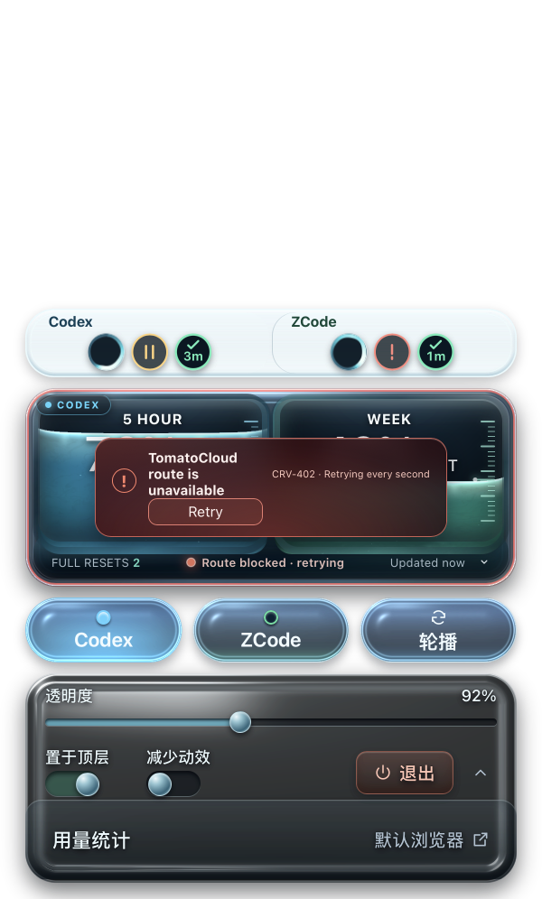
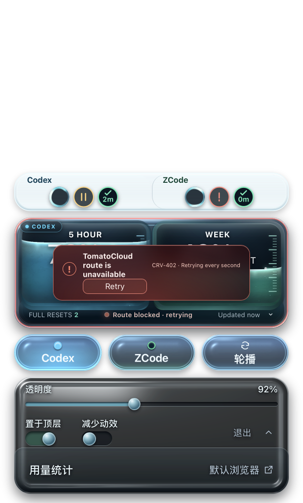

# 设置坞退出按钮重设计：原生验收记录

整体状态：**Acceptance pending**（构建、前端回归、原生视觉验收全部通过；等 bandit0x 现场验收）。未更新 /Applications/QuoDex.app，未推送 GitHub。

来源版本：0.4.0 基线，分支 codex/usage-liquid-glass。环境：macOS 27.0 arm64、Apple Silicon、Retina 2×、Node 24、npm 11、Rust release、Tauri WKWebView。窗口渲染含 `--overlay-scale: 0.5`，设计像素经 0.5 缩放后由 2× 截图 1:1 还原为物理像素。

| 检查 | 状态 | 实际结果与证据 |
| --- | --- | --- |
| TypeScript | Verified | `npm run typecheck` 退出码 0。 |
| 前端回归 | Verified | 12 文件、169 项全部通过；「退出应用」按钮按 accessible name 断言的用例不改自过。 |
| Release 构建 | Verified | `npm run tauri:build -- --bundles app` 退出码 0，产物 `src-tauri/target/release/bundle/macos/QuoDex.app`（0.4.0）。 |
| 改前基线 | Verified | 旧构建（/Applications 0.4.0 同 UI）以夹具启动，右键打开设置坞：退出为无描边暗灰裸文字（字高约 13px 物理），紧邻折叠箭头，确认"小且不醒目"。、[局部](before-dock.png) |
| 重设计落位 | Verified | 独立视觉验收（4× 放大像素测量）：按钮包围盒实测 108×48 物理像素（实体强色区 96×36 + 柔和描边/光晕），与规格一致；电源图标与「退出」字形锐利无变形；珊瑚暖色在全冷色面板中承担「离开应用」语义区隔。、[局部](after-dock.png) |
| 布局回归 | Verified | 与折叠箭头水平间距约 19px、与用量统计分隔线无重叠无裁切、行内垂直居中正常；「已保存/正在保存」状态列收窄至 96px 设计宽仍完整显示。 |
| 窗口预算 | Verified | 设置坞各状态行高与整窗高度公式零变化；`prefers-reduced-motion` 下取消位移动效。 |
| 用户视觉验收 | Acceptance pending | 待 bandit0x 对照改前/改后现场确认。 |

## 设计要点

- 44px 透明文字按钮 → 108×48 实体胶囊：电源图标 + 「退出」，`--danger #ff8067` 珊瑚系描边与暖色渐变（DESIGN.md `quit-action` 契约同步更新）。
- 行网格 `100px 112px minmax(0,1fr) 108px 36px`：新增宽度全部取自原弹性「已保存」状态列（160→96px），不动窗口高度。
- 单击仍直接 `quitApp()`（退出前提交预览并等待串行写入的原语义不变），未加确认弹窗。

## 可复现步骤

    npm run typecheck && npm test
    npm run tauri:build -- --bundles app
    python3 fixtures/task-capsules-macos.py --app src-tauri/target/release/bundle/macos/QuoDex.app --output .scratch/quit-redesign-qa --y 1200 --tasks-per-source 3
    # 对旧构建改用 --app /Applications/QuoDex.app 即得改前基线；右键主仓打开设置坞后对窗口截图

四张截图均来自最终真实打包 App，匿名 SQLite/IPC 夹具，未裁切重绘（dock 局部为底部 380 物理像素条裁切）；QA 实例已退出，已装实例保持原状。
