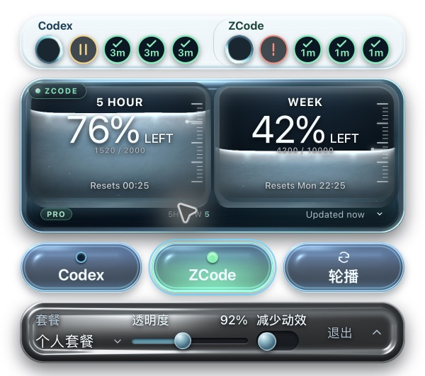

# 设置玻璃坞与任务容量：原生验收记录

整体状态：**Blocked**（暗色与纹理背景透射缺少可靠截图）。本轮中性底舱和两组五任务在 macOS 白底下为 **Verified**；用户视觉验收为 **Acceptance pending**。本轮已更新 /Applications/QuoDex.app，未推送 GitHub。

来源版本：v0.2.5，基线 907a37c，分支 codex/task-source-capsules。环境：macOS 27.0.1 / 26A434、Apple Silicon arm64、Retina 2×、Node 24、npm 11、Rust、Tauri WKWebView。Windows 未运行。

| 检查 | 状态 | 实际结果与证据 |
| --- | --- | --- |
| 构建 | Verified | TypeScript、Vite、Rust release、App、runtime 注入及 DMG 生成成功。首次 DMG 创建受环境限制，最终在允许磁盘映像操作的环境成功。[构建输出](package-build.txt) |
| 前端回归 | Verified | 10 文件、108 项通过；新增两组各五项及名称各按数量移位，溢出保持第五项；设置尺寸、保存排队、退出等待和失败不退出继续通过。[测试输出](frontend-test.txt) |
| Rust 偏好 | Verified | 3 项通过，覆盖默认值、旧格式兼容与保存恢复。[测试输出](rust-preferences-test.txt) |
| 签名与 DMG | Verified | codesign 深度严格核验成功；hdiutil verify 成功。[DMG 输出](dmg-verify.txt)、[产物指纹](artifact-proof.json) |
| 中性底舱 | Verified | 控制仓左右蓝绿分色消除，白色曲面反光、内壁回光与下沿暗部可辨；默认额度仓及三个来源透镜保留。WebGL 与 CSS 后备均取消左右分色，后备修正经源码复核；后备观感不冒充 WebGL 截图。[真实标准图](native-neutral-five-standard.png)、[独立审查](correction-review.md) |
| 两组五项与窄条 | Verified | 标准 600×532、窄条 520×368 物理像素，对应 300/260px 逻辑宽度；两组各五个实际状态完整可见，状态图形保持原尺寸。任务预算从 36px 改为 44px，框体继续分离。[标准](native-neutral-five-standard.png)、[窄条](native-neutral-five-narrow.png) |
| 六项溢出 | Verified | 匿名数据从五项增加至六项，两组仍各显示五个实际状态；+1 位于名称行，点击显示所属来源六项列表并收起设置。[窄条](native-neutral-six-narrow.png)、[列表](native-neutral-six-task-list.png) |
| 少量与不等数量 | Verified | 两组各两项时名称在左侧；Codex 六项与 ZCode 两项时独立排布。ZCode 夹具从六项减少到两项后，名称真实返回左侧；两组数量切换另有 React 回归。[两项](native-neutral-two-standard.png)、[不等数量窄条](native-neutral-asymmetric-narrow.png) |
| 公共诊断 | Verified | 六项与 QDT-613 同时存在时，窄条仍各保留五个实际任务，公共按钮位于名称行；点击详情可达，不遮挡状态圆点。[窄条](native-neutral-diagnostic-narrow.png)、[详情](native-neutral-diagnostic-details.png) |
| 调整与保存 | Verified | 真实键盘将透明度从 92% 改至 94%，隔离配置写入 0.94；焦点沿槽，勾与收起箭头独立。[操作](native-neutral-operating.png)、[保存后](native-neutral-saved.png) |
| 失败与重试 | Verified | 仅将匿名配置设为 0400 后操作，真实报 CRV-304，保留所选值；恢复 0600 后重试写入 reducedMotion: true，错误行消失。失败图 600×580，增加 24px 逻辑高度。[失败](native-neutral-failed.png)、[重试](native-neutral-retried.png) |
| 关闭与任务列表 | Verified | Esc 恢复主仓，任务条与额度仓分离；从设置点击 +1，收起设置后显示所属来源列表。[关闭](native-neutral-five-closed.png)、[列表](native-neutral-six-task-list.png) |
| 跨背景透射 | Blocked | 既有原生捕获出现 SCStream -3811/-3812；本轮没有取得新的明暗及纹理背景证据，继续保留限制。不能以白底或模型参数代替。 |
| 安装后启动 | Verified | 安装后二进制与验证包相同，启动读取真实额度，两组任务、显示设置及全部控制同时呈现。仅保存完整 AX 树的布尔检查结果，不保存真实聊天内容。[安装与冒烟记录](installed-smoke.json) |
| 用户视觉验收 | Acceptance pending | 按用户最新两项修正实施，尚未对最终原生画面作出验收；之前目标图的蓝绿色块已被否决。[当前设计契约](../../design/settings-control-chamber/README.md) |

构建产物为 release/macos/QuoDex.app 和 release/macos/QuoDex_0.2.5_aarch64.dmg，均为本地文件。安装采用暂存、签名核验、替换和二进制指纹核对，旧 App 的备份路径见 [installed-smoke.json](installed-smoke.json)。

13 张本轮公开截图来自最终真实打包 App，在三个干净临时目录中使用匿名 SQLite、IPC 与额度夹具，未裁切或重绘；没有以网页预览替代原生图。测试目录与用户配置分离。来源及指纹见 [artifact-proof.json](artifact-proof.json)。公共诊断夹具的 Codex 额度刷新曾返回 CRV-110；该夹具只用于任务诊断布局检查，以匿名 ZCode 额度完成截图，不作为 Codex 额度协议通过证据。三个 QA App 已退出；安装版保持打开设置，供现场查看。

可复现步骤：

    npm test
    cargo test --manifest-path src-tauri/Cargo.toml preferences::tests
    npm run package:app
    codesign --verify --deep --strict release/macos/QuoDex.app
    hdiutil verify release/macos/QuoDex_0.2.5_aarch64.dmg
    python3 fixtures/task-capsules-macos.py --launch-services --tasks-per-source 5 --output .scratch/settings-native-five --y 400

读取 native-ready.json 的独立 QA App 路径；其 pid 是 open -W 启动器。右键主仓打开设置，选择 ZCode；Tab 到滑轨后按 Right。仅在夹具配置文件上切换写入权限测试失败与重试。Esc 关闭，展开主仓后切到窄条并再次打开设置。另以 --tasks-per-source 2、6 和 --common-diagnostic 启动独立夹具核对少量、溢出及公共诊断。结束用 QA App 退出操作。

历史候选保留作反例：[首次 B](native-standard.png)、[烟灰浅坞](rejected-shallow-standard.png)、[首个曲面但高光不足](rejected-curved-standard.png)、[中心偏平](partial-curved-standard.png)、[本轮被否决的蓝绿分色及三任务条](native-curved-standard.png)。它们不代表当前安装产物，历史审查见 [material-review.md](material-review.md)。
