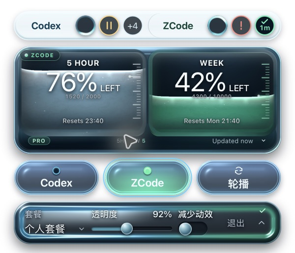

# 设置玻璃坞：原生验收记录

整体状态：**Blocked**（暗色与纹理背景透射缺少可靠截图）。白底下反光、高光和厚壁的修正项已通过独立对照，用户视觉验收为 **Acceptance pending**。本轮已更新 /Applications/QuoDex.app，未推送 GitHub。

来源版本：v0.2.5，基线 5a817fa，分支 codex/task-source-capsules。环境：macOS 27.0.1 / 26A434、Apple Silicon arm64、Retina 2×、Node 24、npm 11、Rust、Tauri WKWebView。Windows 未运行。

| 检查 | 状态 | 实际结果与证据 |
| --- | --- | --- |
| 构建 | Verified | TypeScript、Vite、Rust release、App、runtime 注入及 DMG 生成成功。[构建输出](package-build.txt) |
| 前端回归 | Verified | 10 文件、106 项通过；包括设置尺寸、保存排队、退出等待写入及失败不退出。[测试输出](frontend-test.txt) |
| Rust 偏好 | Verified | 3 项通过，覆盖默认值、旧格式兼容与保存恢复。[测试输出](rust-preferences-test.txt) |
| 签名与 DMG | Verified | codesign 深度严格核验成功；hdiutil verify 成功。[DMG 输出](dmg-verify.txt)、[产物指纹](artifact-proof.json) |
| 原生首屏与窄条 | Verified | 标准 600×516、窄条 520×352 物理像素，对应 300/260px 逻辑宽度。任务条与液态仓分离，三个来源按钮保留。[标准](native-curved-standard.png)、[窄条](native-curved-narrow.png) |
| 调整与保存 | Verified | 键盘将透明度从 92% 改到 94%，隔离配置写入 0.94；焦点沿槽，勾与收起箭头独立。[操作](native-curved-operating.png)、[成功](native-curved-saved.png) |
| 失败与重试 | Verified | 仅将匿名配置设为 0400 后操作，真实报 CRV-304，保留所选值；恢复 0600 后重试写入 reducedMotion: true，错误行消失。失败图 600×564，增加 24px 逻辑高度。[失败](native-curved-failed.png)、[重试](native-curved-retried.png) |
| 关闭与任务列表 | Verified | Esc 恢复主仓；从设置点击 Codex 来源，收起设置后显示独立任务列表。[关闭](native-curved-closed.png)、[列表](native-curved-task-list.png) |
| 白底材质对照 | Verified | 曲面反射由左上延伸至中央，青绿厚壁有可辨宽度；最后 verdict pass 将 M1 判为 resolved，ship 仅限这一白底修正项。[对照记录](material-review.md) |
| 跨背景透射 | Blocked | 已尝试本机明暗/纹理背景页；原生捕获出现 SCStream -3811/-3812，未得到可作为透射证据的截图。不能以白底或模型参数代替。 |
| 安装后启动 | Verified | 安装后二进制与验证包相同；启动读取真实额度，两组任务及显示设置正常呈现。仅保存布尔检查结果，不保存真实聊天内容。[安装与冒烟记录](installed-smoke.json) |
| 用户视觉验收 | Acceptance pending | 用户批准了[材质目标](../../design/settings-control-chamber/README.md)，尚未对最终原生画面作出验收。 |

构建产物为 release/macos/QuoDex.app 和 release/macos/QuoDex_0.2.5_aarch64.dmg，均为本地文件。安装采用暂存、签名核验与替换，旧 App 保留在 /private/tmp/quodex-settings-backup-gyeqt5qu/QuoDex.app。

所有公开截图来自最终真实打包 App 在干净临时目录中的匿名 SQLite、IPC 与额度夹具，未裁切或重绘；没有以网页预览替代原生图。测试目录与用户配置分离。截图指纹及来源见 [artifact-proof.json](artifact-proof.json)。QA App 已退出；安装版保持打开设置，供现场查看。

可复现步骤：

    npm test
    cargo test --manifest-path src-tauri/Cargo.toml preferences::tests
    npm run package:app
    codesign --verify --deep --strict release/macos/QuoDex.app
    hdiutil verify release/macos/QuoDex_0.2.5_aarch64.dmg
    python3 fixtures/task-capsules-macos.py --launch-services --output .scratch/settings-native --y 400

读取 native-ready.json 的独立 QA App 路径；其 pid 是 open -W 启动器。右键主仓打开设置，选择 ZCode；Tab 到滑轨后按 Right。仅在夹具配置文件上切换写入权限测试失败与重试。Esc 关闭，展开主仓后切到窄条并再次打开设置。结束用 QA App 退出操作。

历史候选保留作反例：[首次 B](native-standard.png)、[烟灰浅坞](rejected-shallow-standard.png)、[首个曲面但高光不足](rejected-curved-standard.png)、[宽壁已改善但中心偏平](partial-curved-standard.png)。它们不代表当前安装产物。来源按钮与默认液态仓没有在后两批材质修正中重做。
